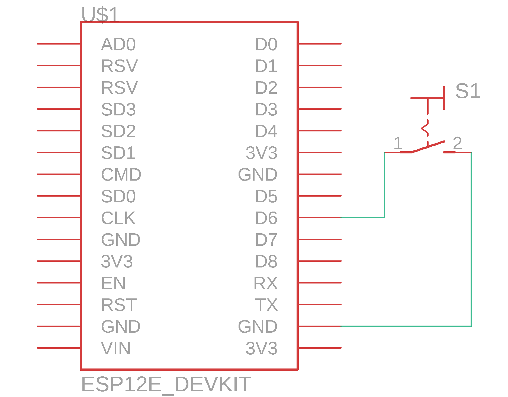

# Active Audio Output Button

Active Audio Output Button is an ESP8266 project to change the active audio output of the computer running the server script via the click of a single button.

## Required hardware
1. ESP8266 or anything similar that can make a POST request.
2. A basic switch to set the state. I would have recommended a button instead and was planning to use a button instead but couldn't get one in a timely manner (Thanks COVID, I guess...) so had to change plans. If you want to use a button, take a look at the [Commit #7](https://github.com/denizariyan/active-audio-output-button/commit/adf1c4ed256911dad928ef9f8dc073ac4bbff7f3).
3. A power supply to power the ESP8266 or the board of your choice. I'm using a Lithium-Ion battery pack consisting of 2 18650 batteries so I can haul the device around but won't be explaining here how to do that. If you are interested I recommend [Great Scott on YouTube](https://www.youtube.com/user/greatscottlab), he explains these topics very well.

## Server deployment

On the computer that you want to control the audio output:
1. `git clone https://github.com/denizariyan/active-audio-output-button.git`
1. `cd active-audio-output-button`
1. delete the `.git` folder (`rm -rf .git`)
1. `npm install` to get&update the dependencies
1. `npm start` to run the server on the port 8081

## TODO: Add documentation for the hardware side and what values to set in the API endpoint

## Circuit schematic

Note that the switch is connected directly to the GND. Make sure to use the internal pull-up resistors or an external resistor. Usually, anything from 3k3 to 10k Ohm is fine.

## Contributing

Pull requests are welcome. For major changes, please open an issue first to discuss what you would like to change.

## External dependencies

All code in the [External](https://github.com/denizariyan/active-audio-output-button/tree/main/external) folder is licensed to its rightful owner with their appropriate licenses which you can find in the [External](https://github.com/denizariyan/active-audio-output-button/tree/main/external) folder. The changes to the 3rd party code are not documented but minor, you can check the [changed file](https://github.com/denizariyan/active-audio-output-button/blob/main/external/source/EndPointController/EndPointController.cpp) or diff against the [original repo](https://github.com/davuxcom/audio-endpoint-controller).

## License

Any code that is not in the [External](https://github.com/denizariyan/active-audio-output-button/tree/main/external) folder is licensed under
[MIT](https://choosealicense.com/licenses/mit/). Check the appropriate license files for the 3rd party code.
